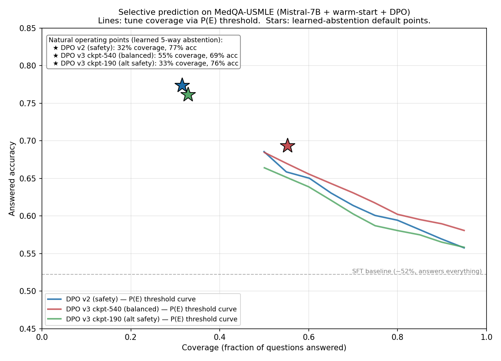

# Mistral-7B MedQA Abstention — Selective Prediction for Reliable Medical QA

A safety-focused project that teaches Mistral-7B to **abstain when uncertain** on
medical multiple-choice questions, cutting high-confidence errors. The project
covers two complementary approaches to abstention:

1. **Post-hoc selective prediction** — an external confidence threshold suppresses
   low-confidence answers (no retraining for the abstention itself).
2. **Learned abstention (DPO)** — the model is *trained* to prefer abstaining over
   giving a confident wrong answer, producing a directed abstention signal that
   reaches operating points post-hoc thresholding cannot.

> The progression is the point: post-hoc thresholding establishes a strong
> selective-prediction baseline; DPO then trains the abstention behavior into the
> model itself, and the two are compared on the same coverage/accuracy axes.

---

## 30-second summary

- Fine-tuned **Mistral-7B** on MedQA-USMLE using **QLoRA**.
- Built a selective-prediction system to reduce confident wrong medical answers.
- Compared two abstention approaches:
  - **Post-hoc confidence thresholding** using answer probabilities.
  - **Learned abstention** using warm-start SFT + DPO.
- Diagnosed a failed DPO run where the model never abstained, then fixed it with warm-start SFT and better DPO design.
- Final balanced learned-abstention model answers **55.3%** of questions with **69.3% answered accuracy**, reducing dataset-level wrong answers from about **48% to 17%**.
- Safety-first DPO model answers **31.6%** of questions with **77.4% answered accuracy**, reducing dataset-level wrong answers to **7.2%**.

---

## 🎯 Problem

Standard fine-tuning optimizes for accuracy but can leave models **overconfident in
wrong answers**. In medical AI, a confident wrong answer is more dangerous than no
answer at all. This project reduces confident-wrong answers two ways — a tunable
post-hoc threshold, and a trained (learned) refusal behavior — and quantifies the
coverage/accuracy tradeoff for each.

Throughout, results are reported as a **(coverage, accuracy) pair**, never accuracy
alone: a model that answers fewer questions more accurately is the entire design
goal, so coverage must always be quoted alongside it.

---

# Part 1 — Post-hoc Selective Prediction (SFT + confidence threshold)

## 📊 Results

### Baseline vs Fine-Tuned (No Abstention)

| Model | Accuracy | Coverage | Wrong Answer Rate |
|-------|----------|----------|-------------------|
| Mistral-7B (base) | 49.33% | 100% | 50.67% |
| Mistral-7B (fine-tuned) | 52.24% | 100% | 47.76% |

### Fine-Tuned with Abstention — Threshold Analysis

| Threshold | Answered Accuracy | Coverage | Dataset-Level Wrong Rate | Abstained |
|-----------|-------------------|----------|--------------------------|-----------|
| 0.00 | 52.24% | 100.00% | 47.76% | 0.00% |
| 0.30 | 53.05% | 96.70% | 45.40% | 3.30% |
| 0.35 | 55.33% | 85.47% | 38.18% | 14.53% |
| 0.40 | 59.89% | 70.70% | 28.36% | 29.30% |
| 0.45 | 64.62% | 57.50% | 20.35% | 42.50% |
| **0.50** | **70.33%** | **45.80%** | **13.59%** | **54.20%** |
| 0.55 | 74.57% | 36.14% | 9.19% | 63.86% |
| 0.60 | 75.69% | 28.44% | 6.91% | 71.56% |
| 0.65 | 79.32% | 23.17% | 4.79% | 76.83% |
| 0.70 | 84.89% | 17.67% | 2.67% | 82.33% |
| 0.75 | 88.95% | 14.22% | 1.57% | 85.78% |
| 0.80 | 91.24% | 10.76% | 0.94% | 89.24% |
| 0.90 | 98.25% | 4.48% | 0.08% | 95.52% |

### 🏆 Balanced Operating Point: threshold = 0.50

| Metric | No Abstention | With Abstention |
|--------|---------------|-----------------|
| Answered Accuracy | 52.24% | 70.33% |
| Coverage | 100% | 45.80% |
| Dataset-Level Wrong Rate | 47.76% | 13.59% |

At threshold 0.50, answered-question accuracy rises from 52.24% to 70.33% while
coverage drops to 45.80%, reducing dataset-level wrong answers from 47.76% to
13.59%. **Note:** this threshold was selected after inspecting test-set results —
a held-out calibration split would make this number more defensible.

### 📈 Matched-Coverage Comparison — Baseline vs Fine-Tuned

Comparing at fixed thresholds is unfair because baseline and fine-tuned models
answer different numbers of questions at the same threshold. Matched-coverage
comparison ensures equal-sized subsets.

| Coverage | Base Acc | FT Acc | Gain | Base Wrong | FT Wrong |
|----------|----------|--------|------|------------|----------|
| 90% | 51.51% | 54.40% | +2.89% | 42.97% | 41.08% |
| 80% | 53.18% | 56.87% | +3.69% | 37.55% | 34.25% |
| 70% | 54.92% | 59.89% | +4.97% | 32.05% | 28.36% |
| 60% | 57.25% | 63.85% | +6.60% | 26.16% | 21.52% |
| 50% | 61.90% | 68.40% | +6.50% | 18.85% | 15.71% |
| 40% | 67.07% | 72.73% | +5.66% | 12.80% | 10.84% |
| 30% | 69.67% | 74.93% | +5.26% | 9.27% | 7.38% |
| 20% | 77.95% | 83.27% | +5.32% | 4.40% | 3.30% |

**Fine-tuned wins at all 8 coverage levels.** Average accuracy gain +5.11%.
Individual per-level differences are not individually significant at n=1,273, but
winning at all 8 levels in the same direction is itself meaningful (sign test
p≈0.004).

## 💡 Key Insight (Part 1)

Fine-tuning's clearest, statistically significant effect is on **coverage**: the
fine-tuned model answers significantly more questions at the same confidence
threshold (bootstrap CIs non-overlapping, +8.47%), indicating sharper confidence
distributions. Accuracy and AUROC gains are directionally positive and consistent
across all 8 matched-coverage levels, but not individually significant at n=1,273.

Calibration is mixed: ECE slightly worsens (0.0304 → 0.0322) while MCE improves
(11.79% → 6.90%). The result is best framed as **improved selective-prediction
behavior**, not improved average calibration.

### Supporting analyses (Part 1)

**Max-Prob vs Entropy (≈50% coverage):** max-prob wins (70.33% / 45.80% / 13.59%
wrong) over entropy (67.73% / 49.41% / 15.95% wrong) — fine-tuning sharpens
distributions, making max-prob the more reliable signal.

**AUROC for error detection:** baseline 0.6738 → fine-tuned 0.7069. Confidence gap
(correct − wrong) widened from +10.8% to +13.2%.

**Bootstrap CIs (95%, n=1000):** coverage improvement (+8.47%) is the only
statistically significant result (CIs non-overlapping). Accuracy/AUROC gains are
directionally positive but not conclusive at 1,273 examples.

**Risk-weighted review (small, n=10):** of 10 manually reviewed high-confidence
wrong answers, 4 were categorized as clinically critical; the abstention mechanism
correctly refused all 4 critical cases in the low-confidence set. Preliminary —
larger expert-reviewed samples are needed.

---

# Part 2 — Learned Abstention (Warm-start + DPO)

Part 1's abstention is **external** — the model always produces a prediction
internally, and a threshold suppresses it. Part 2 asks: can the model *learn* to
abstain, preferring "I cannot answer confidently" over a confident wrong answer?

## The experimental progression (this is the core story)

| Stage | Outcome | What it taught |
|-------|---------|----------------|
| **DPO v1** | **Failed** — abstain rate 0%, P(E) AUROC 0.43 (undirected) | DPO can't create a behavior from ~zero probability mass against a KL leash |
| **Warm-start SFT** | Abstain string lifted from max P(E) 0.02 → 0.39, but undirected | Teaches the abstain *string* exists, not *when* to use it |
| **DPO v2** | **Directed** — P(E) AUROC 0.43 → **0.69**, but over-conservative (68% abstain) | Warm-started reference + abstain-favoring pairs make abstention directional |
| **DPO v3** | **Usable tradeoff** — coverage 55%, P(E) AUROC 0.66 | 1:1 pairs + tighter β + longer warmup center the operating point |

**Root-cause diagnosis of the v1 failure** (the part worth reading): the abstain
completion had near-zero probability under the SFT model (max P(E) = 0.0225). DPO
amplifies *relative* preferences but cannot introduce a behavior from zero,
especially with a KL penalty pulling toward an abstain-averse reference, and with
answer-favoring (1:2) pairs whose net gradient pushed abstain *down*. The fix
addressed all three: a warm-start SFT pass to give the abstain string real mass,
a warm-started (not abstain-averse) DPO reference, and abstain-favoring pairs.

## Final models (full 1,273-example test set)

| Model | Coverage | Answered Acc | Dataset Wrong | P(E) AUROC | Role |
|-------|----------|--------------|---------------|------------|------|
| SFT baseline | ~100% | 52.2% | ~48% | — | answers everything |
| **DPO v2** | 31.6% | 77.4% | **7.2%** | **0.694** | safety-first |
| **DPO v3 (ckpt-540)** | **55.3%** | 69.3% | 17.0% | 0.660 | balanced (headline) |
| DPO v3 (ckpt-190) | 32.9% | 76.1% | 7.9% | 0.663 | alt safety point |

**Headline framing:** v2 and v3 are two points on one coverage/directedness
tradeoff. v3 moves the *natural* operating point from 32% → 55% coverage at a small
calibration cost (P(E) AUROC 0.694 → 0.660). Both models expose a directed P(E) score
score that can be thresholded to choose operating points along the coverage/safety curve.

## The result, in one figure



- **Lines** = coverage/accuracy reachable by thresholding each model's P(E) score.
- **Stars** = each model's *natural* (learned 5-way argmax) operating point.
- All curves sit well above the SFT baseline (~52%, answers everything).

**Key insight from the figure:** the stars sit *above and to the left* of the P(E)
curves — the learned 5-way abstention reaches a low-coverage/high-accuracy region
(≈32% coverage, ≈77% accuracy) that post-hoc P(E) thresholding cannot reach
(thresholding bottoms out near 50% coverage). This is the concrete payoff of
**training** abstention into the model rather than bolting a threshold on top.

## Methodology choices worth defending

- **Evaluation by full-sentence completion scoring** (mean per-token log-prob of
  `" The answer is X."` vs `" I cannot answer confidently."`), matching the DPO
  training format exactly — not next-token A–E scoring, which measures an
  out-of-distribution format.
- **P(E) as the deployment signal.** The natural argmax proved bistable across
  training (v1 0% / warm-start ~30% / v2 68% abstain), so rather than force the
  argmax to a target coverage, we train a directed P(E) score and threshold it —
  how selective prediction is actually deployed.
- **Per-type training monitor.** v1's overall pairwise accuracy (0.72) hid that the
  abstain side was ~0.0 while the answer side was ~0.95. v2/v3 log a live
  coverage/abstain readout so over-abstention is visible during training.
- **Dense checkpointing.** v3 saved every 10 steps (all kept), letting the best
  operating point be selected from the full coverage/AUROC trajectory post-hoc.
- **Honest tradeoff:** pushing natural coverage 32% → 55% cost ~0.03 P(E) AUROC.
  Named, not hidden.

## Run the DPO models

```bash
# Headline balanced model (v3 ckpt-540)
DPO_ADAPTER=./mistral-medqa-dpo-v3/checkpoint-540/policy \
TOKENIZER_PATH=./mistral-medqa-dpo-v3-final \
python dpo_eval_full.py

# Reproduce the figure
python plot_selective_prediction.py
```

---

## 🧠 Concepts Demonstrated

- Parameter-efficient fine-tuning (QLoRA)
- Selective prediction (accuracy–coverage tradeoff)
- **Direct Preference Optimization (DPO) for learned abstention**
- **Warm-start SFT to introduce a behavior before preference optimization**
- Confidence calibration (ECE, MCE), max-prob vs entropy abstention
- AUROC error detection, bootstrap confidence intervals
- Root-cause debugging of a failed training run + targeted fixes
- Reliability-aware evaluation beyond accuracy

## 🛠️ Engineering Highlights

- End-to-end SFT → warm-start → DPO pipeline for Mistral-7B on MedQA (single V100)
- QLoRA training; learned-abstention via DPO with a warm-started reference adapter
- Diagnosed a failed DPO run (zero abstain mass, abstain-averse reference,
  answer-favoring pairs) and fixed all three causes
- Full-sentence completion scoring eval with a calibrated P(E) abstention signal
- Live per-type training monitor + dense checkpointing for post-hoc model selection
- Reproducible JSON outputs and a coverage/accuracy figure across all models

---

## 🏗️ Architecture

```
Base Model : mistralai/Mistral-7B-v0.3
Method     : QLoRA (4-bit) + DPO
LoRA       : r=16, alpha=32, targets q_proj/v_proj
SFT        : early stopping (patience=3) on MedQA-USMLE
Warm-start : short SFT pass introducing the abstain completion
DPO        : warm-started policy + frozen warm-started reference,
             beta 0.05–0.10, full-sentence A/B/C/D/E completions
Dataset    : GBaker/MedQA-USMLE-4-options (10,178 train / 1,273 test)
```

## 📁 Project Structure

```
mistral-medqa-abstention/
│
├── Part 1 — post-hoc selective prediction
│   ├── baseline_eval.py / train_lora.py / finetuned_eval.py
│   ├── abstention_analysis.py / entropy_abstention.py
│   ├── reliability_diagram.py / risk_analysis.py
│   ├── compare_abstention.py / auroc_analysis.py / confidence_intervals.py
│   └── predict.py
│
├── Part 2 — learned abstention (DPO)
│   ├── build_dpo_pairs_v2.py        # build preference pairs (ratio configurable)
│   ├── train_warmstart.py           # warm-start SFT (lift abstain off zero)
│   ├── train_dpo_v3.py              # DPO training (warm-started reference)
│   ├── dpo_eval_full.py             # full-sentence eval + P(E) sweep
│   ├── eval_checkpoints.py          # trajectory sweep over checkpoints
│   ├── plot_selective_prediction.py # the coverage/accuracy figure
│   └── final_dpo_v3_results/        # full-eval JSONs for all candidates
│
├── selective_prediction_curve.png
└── README.md
```

## ⚠️ Limitations

- Multiple-choice USMLE-style questions only — not open-ended clinical advice.
- Part 1 abstention is post-hoc thresholding; Part 2 is learned but the abstention
  signal AUROC (0.66–0.69) is moderate, not a near-perfect error detector.
- Results always quote (coverage, accuracy) together — high accuracy figures come
  with reduced coverage.
- Part 1 thresholds were selected on test-set results; a held-out calibration split
  would be more rigorous.
- Risk-weighted analysis is preliminary (n=10).
- Not for real clinical decision-making.

## 🗂️ Dataset & Hardware

**GBaker/MedQA-USMLE-4-options** — 10,178 train / 1,273 test, USMLE Step 1/2/3,
4-option MC. Train/val 90/10 (seed=42); official test set never used for training
or early stopping.

GPU: NVIDIA Tesla V100-32GB. SFT ~1.5h; warm-start ~45 min; DPO v3 full run
~10h (dense eval every 10 steps).

## 🔗 Model on HuggingFace

[Primeinvincible/mistral-medqa-lora-v3](https://huggingface.co/Primeinvincible/mistral-medqa-lora-v3)
(SFT adapter; DPO adapters maintained as local checkpoints)

## Model Checkpoints

The original SFT adapter is available on Hugging Face:

[Primeinvincible/mistral-medqa-lora-v3](https://huggingface.co/Primeinvincible/mistral-medqa-lora-v3)

The warm-start and DPO adapters are not stored directly in this GitHub repository because they are model checkpoint artifacts. The repository instead includes:

- training and evaluation scripts
- final evaluation JSONs
- checkpoint tradeoff summaries
- selective-prediction figure
- full methodology and metrics

The selected DPO checkpoints are:

| Checkpoint | Role |
|---|---|
| `mistral-medqa-dpo-v3/checkpoint-540/policy` | balanced learned-abstention model |
| `mistral-medqa-dpo-v2-final/policy` | safety-first model |
| `mistral-medqa-dpo-v3/checkpoint-190/policy` | alternate safety checkpoint |

These adapters can be uploaded to Hugging Face separately if needed.

## 👤 Author

Master's student specializing in NLP/LLM safety and production deployment. Part of
a portfolio focused on making LLM systems reliable for real-world use.